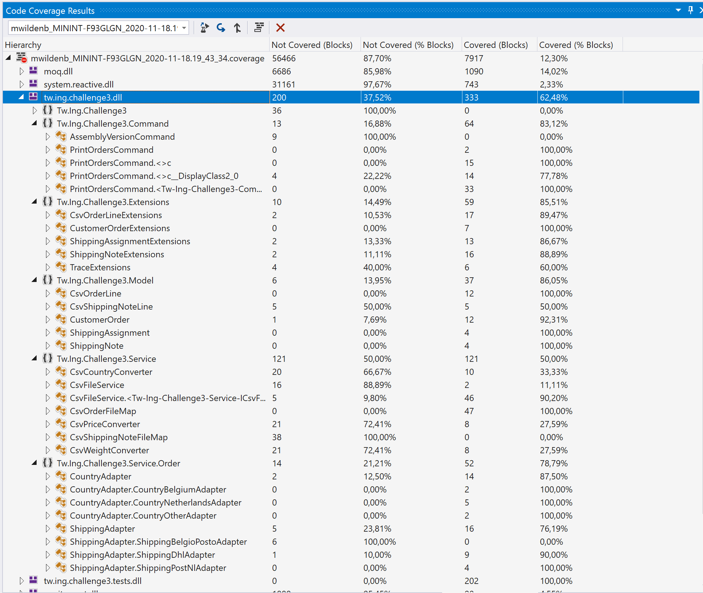
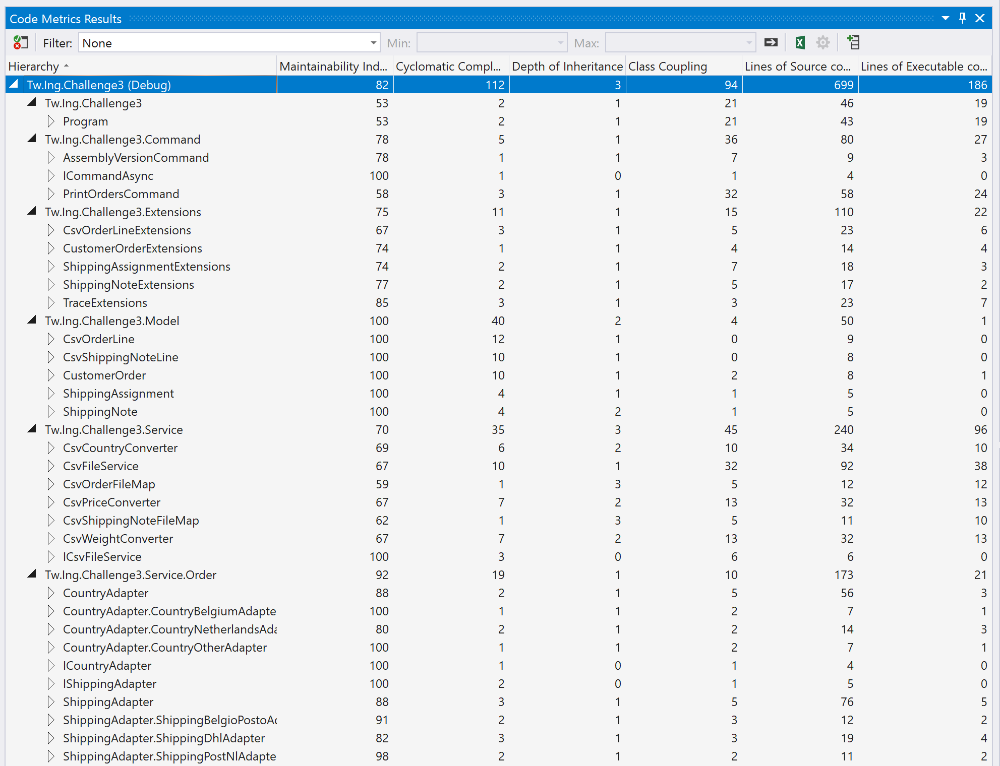

# IngBytes

      _____ _           _ _                         ____  
     / ____| |         | | |                       |___ \ 
    | |    | |__   __ _| | | ___ _ __   __ _  ___    __) |
    | |    | '_ \ / _` | | |/ _ \ '_ \ / _` |/ _ \  |__ < 
    | |____| | | | (_| | | |  __/ | | | (_| |  __/  ___) |
     \_____|_| |_|\__,_|_|_|\___|_| |_|\__, |\___| |____/ 
                                        __/ |             
                                       |___/              

Some tips for the reviewer:
- The [Program.cs](https://github.com/teamwildenberg/IngBytes/blob/main/c3/Src/Program.cs) - Program entry, initialization of services  
- The [CommandObjects](https://github.com/teamwildenberg/IngBytes/blob/main/c3/Src/Command/PrintOrdersCommand.cs) - Executes the order processing using [ReactivX](http://reactivex.io/). 
  - All object transitions are implemented as [Extensions](https://github.com/teamwildenberg/IngBytes/blob/main/c3/Src/Extensions)
  - All interfaces are implemented as services [Services](https://github.com/teamwildenberg/IngBytes/blob/main/c3/Src/Service)
    - [CsvFileWriter](https://github.com/teamwildenberg/IngBytes/blob/main/c3/Src/Service/Csv/CsvFileService.cs) for Input / Result of the CSV files
    - [CountryAdapter](https://github.com/teamwildenberg/IngBytes/blob/main/c3/Src/Service/Order/CountryAdapter.cs) for the different country rules
    - [ShippingAdapter](https://github.com/teamwildenberg/IngBytes/blob/main/c3/Src/Service/Order/ShippingAdapter.cs) for the different shipper rules

### Result Sets
#### Tw.Ing.Challenge3.Tests.dll - 100%

<strong>Overall Result:</strong> ✔️ Pass  
<strong>Pass Rate:</strong> 100%  
<strong>Run Duration:</strong> 2s 83ms  
<strong>Date:</strong> 2020-11-18 19:28:18 - 2020-11-18 19:28:20  
<strong>Framework:</strong> .NETCoreApp,Version=v5.0  
<strong>Total Tests:</strong> 12  

<table>
<thead>
<tr>
<th>✔️ Passed</th>
<th>❌ Failed</th>
<th>⚠️ Skipped</th>
</tr>
</thead>
<tbody>
<tr>
<td>12</td>
<td>0</td>
<td>0</td>
</tr>
<tr>
<td>100%</td>
<td>0%</td>
<td>0%</td>
</tr>
</tbody>
</table>

### Result Sets
#### Tw.Ing.Challenge3.Tests.dll - 100%

Full Results

<table>
<thead>
<tr>
<th>Result</th>
<th>Test</th>
<th>Duration</th>
</tr>
</thead>
<tr>
<td> ✔️ Passed </td>
<td>Tw.Ing.Challenge3.Tests.PrintOrdersCommandTests.DownloadOrderCsv_NotFound</td>
<td>224ms</td>
</tr>
<tr>
<td> ✔️ Passed </td>
<td>Tw.Ing.Challenge3.Tests.CountryAdapterTests.OrderBelgium_Success</td>
<td>1ms</td>
</tr>
<tr>
<td> ✔️ Passed </td>
<td>Tw.Ing.Challenge3.Tests.CountryAdapterTests.OrderNetherlands_11kg_Success</td>
<td>< 1ms</td>
</tr>
<tr>
<td> ✔️ Passed </td>
<td>Tw.Ing.Challenge3.Tests.CountryAdapterTests.OrderNetherlands_10kg_Success</td>
<td>< 1ms</td>
</tr>
<tr>
<td> ✔️ Passed </td>
<td>Tw.Ing.Challenge3.Tests.CountryAdapterTests.OrderNetherlands_9kg_Success</td>
<td>< 1ms</td>
</tr>
<tr>
<td> ✔️ Passed </td>
<td>Tw.Ing.Challenge3.Tests.CountryAdapterTests.OrderOther_Success</td>
<td>< 1ms</td>
</tr>
<tr>
<td> ✔️ Passed </td>
<td>Tw.Ing.Challenge3.Tests.OrderProcessingServiceTests.ShippingAssignmentToConfirmation_Success</td>
<td>2ms</td>
</tr>
<tr>
<td> ✔️ Passed </td>
<td>Tw.Ing.Challenge3.Tests.OrderProcessingServiceTests.OrderToShippingAssignment_Success</td>
<td>< 1ms</td>
</tr>
<tr>
<td> ✔️ Passed </td>
<td>Tw.Ing.Challenge3.Tests.CsvServiceTests.DownloadOrderCsv_Success</td>
<td>283ms</td>
</tr>
<tr>
<td> ✔️ Passed </td>
<td>Tw.Ing.Challenge3.Tests.OrderProcessingServiceTests.LineToOrder_Success</td>
<td>9ms</td>
</tr>
<tr>
<td> ✔️ Passed </td>
<td>Tw.Ing.Challenge3.Tests.CsvServiceTests.DownloadOrderCsv_NotFound</td>
<td>20ms</td>
</tr>
<tr>
<td> ✔️ Passed </td>
<td>Tw.Ing.Challenge3.Tests.CsvServiceTests.DownloadOrderCsv_InvalidCountry</td>
<td>10ms</td>
</tr>
</tbody>
</table>

### Run Messages

Informational

<pre><code>
[xUnit.net 00:00:00.00] xUnit.net VSTest Adapter v2.4.3+1b45f5407b (64-bit .NET 5.0.0)
[xUnit.net 00:00:00.71]   Discovering: Tw.Ing.Challenge3.Tests
[xUnit.net 00:00:00.76]   Discovered:  Tw.Ing.Challenge3.Tests
[xUnit.net 00:00:00.77]   Starting:    Tw.Ing.Challenge3.Tests
[xUnit.net 00:00:01.21]   Finished:    Tw.Ing.Challenge3.Tests
</code></pre>

Warning

<pre><code>
Data collector 'Code Coverage' message: No code coverage data available. Code coverage is currently supported only on Windows..
</code></pre>

Error

<pre><code>
</code></pre>

----

[Created using Liquid Test Reports](https://github.com/kurtmkurtm/LiquidTestReports)

### Code Coverage

### Code Analysis

