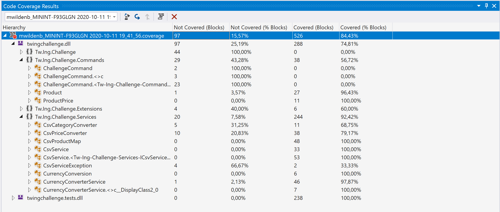
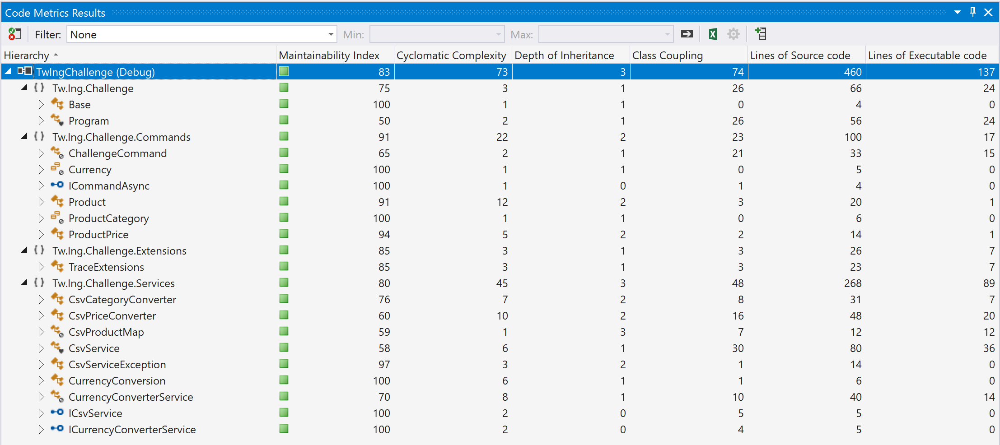

# IngBytes

       _____ _           _ _                                  ___  
      / ____| |         | | |                                |__ \ 
     | |    | |__   __ _| | | ___ _ __   __ _  ___   ______     ) |
     | |    | '_ \ / _` | | |/ _ \ '_ \ / _` |/ _ \ |______|   / / 
     | |____| | | | (_| | | |  __/ | | | (_| |  __/           / /_ 
      \_____|_| |_|\__,_|_|_|\___|_| |_|\__, |\___|          |____|
                                         __/ |                     
                                        |___/                     

## For the Reviewer:

Some tips for the reviewer:
- The [Program.cs](https://github.com/teamwildenberg/IngBytes/blob/main/c2/Src/Program.cs) game-loop together with the [TwgeService.cs](https://github.com/teamwildenberg/IngBytes/blob/main/c2/Src/Services/TwgeService.cs) controls the game
- The [CommandObjects](https://github.com/teamwildenberg/IngBytes/blob/main/c2/Src/Commands) control the flow of the game. For example:
  - [ResetGameCommand.cs](https://github.com/teamwildenberg/IngBytes/blob/main/c2/Src/Commands/ResetGameCommand.cs)
- Each GameObject (Game, Board and Player) has it's own state engine
  - The [Context](https://github.com/teamwildenberg/IngBytes/blob/main/c2/Src/Model/ContextBase.cs) contains the state of the Object. For example:
    - [GameContext](https://github.com/teamwildenberg/IngBytes/blob/main/c2/Src/Model/ContextBase.cs)
  - The State objects determine the behaviour of the Object and when to transition state. For example:
    - [GameStateNew](https://github.com/teamwildenberg/IngBytes/blob/main/c2/Src/Model/GameStateNew.cs)
    - [GameStateActive](https://github.com/teamwildenberg/IngBytes/blob/main/c2/Src/Model/GameStateActive.cs)
    - [GameStateFinished](https://github.com/teamwildenberg/IngBytes/blob/main/c2/Src/Model/GameStateFinished.cs)
- Each GameState Object determines
  - Which Actions they have represented by the Commands (executed by the TwgeService()). For example:
    - [ITweContext.GetActionCommands implemented in GameStateActive.cs](https://github.com/teamwildenberg/IngBytes/blob/main/c2/Src/Model/GameStateActive.cs)
  - How to render their current state (Draw())
    - [ITweContext.Draw implemented in BoardStatePlaying.cs](https://github.com/teamwildenberg/IngBytes/blob/main/c2/Src/Model/BoardStatePlaying.cs)
## Test Run for PR # (23)
### Run Summary

<strong>Overall Result:</strong> ✔️ Pass  
<strong>Pass Rate:</strong> 100%  
<strong>Run Duration:</strong> 2s 156ms  
<strong>Date:</strong> 2020-10-29 20:36:40 - 2020-10-29 20:36:42  
<strong>Framework:</strong> .NETCoreApp,Version=v3.1  
<strong>Total Tests:</strong> 19  

<table>
<thead>
<tr>
<th>✔️ Passed</th>
<th>❌ Failed</th>
<th>⚠️ Skipped</th>
</tr>
</thead>
<tbody>
<tr>
<td>19</td>
<td>0</td>
<td>0</td>
</tr>
<tr>
<td>100%</td>
<td>0%</td>
<td>0%</td>
</tr>
</tbody>
</table>

### Result Sets
#### Tw.Ing.Challenge2.Tests.dll - 100%

Full Results

<table>
<thead>
<tr>
<th>Result</th>
<th>Test</th>
<th>Duration</th>
</tr>
</thead>
<tr>
<td> ✔️ Passed </td>
<td>Tw.Ing.Challenge2.Tests.GameTests.Player_InvalidStates_New</td>
<td>101ms</td>
</tr>
<tr>
<td> ✔️ Passed </td>
<td>Tw.Ing.Challenge2.Tests.GameTests.Game_State_NewToActive_Success</td>
<td>< 1ms</td>
</tr>
<tr>
<td> ✔️ Passed </td>
<td>Tw.Ing.Challenge2.Tests.BoardTests.Board_Play_Success</td>
<td>123ms</td>
</tr>
<tr>
<td> ✔️ Passed </td>
<td>Tw.Ing.Challenge2.Tests.BoardTests.Board_State_FinishedToBlanco_Success</td>
<td>1ms</td>
</tr>
<tr>
<td> ✔️ Passed </td>
<td>Tw.Ing.Challenge2.Tests.BoardTests.Board_State_DrawnToFinished_Success</td>
<td>< 1ms</td>
</tr>
<tr>
<td> ✔️ Passed </td>
<td>Tw.Ing.Challenge2.Tests.BoardTests.Board_InvalidStates_Finished</td>
<td>< 1ms</td>
</tr>
<tr>
<td> ✔️ Passed </td>
<td>Tw.Ing.Challenge2.Tests.BoardTests.Board_InvalidStates_Drawn</td>
<td>< 1ms</td>
</tr>
<tr>
<td> ✔️ Passed </td>
<td>Tw.Ing.Challenge2.Tests.BoardTests.PlayBoard_Success</td>
<td>< 1ms</td>
</tr>
<tr>
<td> ✔️ Passed </td>
<td>Tw.Ing.Challenge2.Tests.BoardTests.Board_InvalidStates_Blanco</td>
<td>< 1ms</td>
</tr>
<tr>
<td> ✔️ Passed </td>
<td>Tw.Ing.Challenge2.Tests.BoardTests.Board_State_BlancToDrawn_Success</td>
<td>4ms</td>
</tr>
<tr>
<td> ✔️ Passed </td>
<td>Tw.Ing.Challenge2.Tests.BoardTests.Board_Play_TwiceError</td>
<td>< 1ms</td>
</tr>
<tr>
<td> ✔️ Passed </td>
<td>Tw.Ing.Challenge2.Tests.PlayerTests.Player_State_AtHandToActive_Success</td>
<td>34ms</td>
</tr>
<tr>
<td> ✔️ Passed </td>
<td>Tw.Ing.Challenge2.Tests.PlayerTests.Player_State_NewToActive_Success</td>
<td>1ms</td>
</tr>
<tr>
<td> ✔️ Passed </td>
<td>Tw.Ing.Challenge2.Tests.PlayerTests.Player_InvalidStates_Active</td>
<td>1ms</td>
</tr>
<tr>
<td> ✔️ Passed </td>
<td>Tw.Ing.Challenge2.Tests.PlayerTests.Player_State_ActiveToAtHand_Success</td>
<td>1ms</td>
</tr>
<tr>
<td> ✔️ Passed </td>
<td>Tw.Ing.Challenge2.Tests.PlayerTests.Player_InvalidStates_Win</td>
<td>1ms</td>
</tr>
<tr>
<td> ✔️ Passed </td>
<td>Tw.Ing.Challenge2.Tests.PlayerTests.Player_State_AtHandToWin_Success</td>
<td>< 1ms</td>
</tr>
<tr>
<td> ✔️ Passed </td>
<td>Tw.Ing.Challenge2.Tests.PlayerTests.Player_InvalidStates_AtHand</td>
<td>< 1ms</td>
</tr>
<tr>
<td> ✔️ Passed </td>
<td>Tw.Ing.Challenge2.Tests.PlayerTests.Player_InvalidStates_New</td>
<td>2ms</td>
</tr>
</tbody>
</table>

### Run Messages

Informational

<pre><code>
[xUnit.net 00:00:00.00] xUnit.net VSTest Adapter v2.4.0 (64-bit .NET Core 3.1.5)
[xUnit.net 00:00:00.45]   Discovering: Tw.Ing.Challenge2.Tests
[xUnit.net 00:00:00.50]   Discovered:  Tw.Ing.Challenge2.Tests
[xUnit.net 00:00:00.50]   Starting:    Tw.Ing.Challenge2.Tests
[xUnit.net 00:00:00.76]   Finished:    Tw.Ing.Challenge2.Tests
</code></pre>

Warning

<pre><code>
Data collector 'Code Coverage' message: No code coverage data available. Code coverage is currently supported only on Windows..
</code></pre>

Error

<pre><code>
</code></pre>

----

[Created using Liquid Test Reports](https://github.com/kurtmkurtm/LiquidTestReports)

### Code Coverage

### Code Analysis

