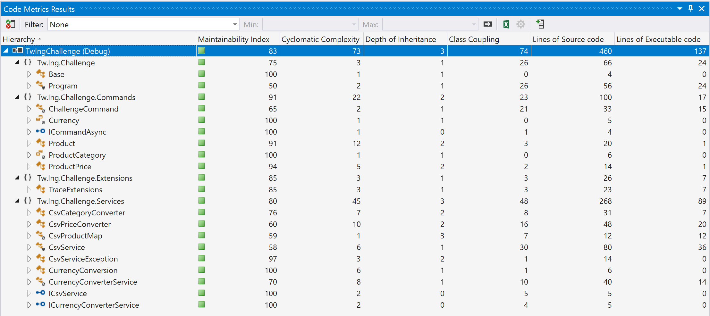

# IngBytes

       _____ _           _ _                                  __
      / ____| |         | | |                                /_ |
     | |    | |__   __ _| | | ___ _ __   __ _  ___   ______   | |
     | |    | '_ \ / _` | | |/ _ \ '_ \ / _` |/ _ \ |______|  | |
     | |____| | | | (_| | | |  __/ | | | (_| |  __/           | |
      \_____|_| |_|\__,_|_|_|\___|_| |_|\__, |\___|           |_|
                                         __/ |
                                         |___/

## For the Reviewer:

Some tips for the reviewer:
- [ChallengeCommand.cs](https://github.com/teamwildenberg/IngBytes/blob/main/Src/Commands/ChallengeCommand.cs) is the start of the implemention, following the command pattern.
- [Command Line](https://github.com/teamwildenberg/IngBytes/suites/1322330937/artifacts/21071581) can be downloaded from the build (Win-X64)
- [Test Report](https://github.com/teamwildenberg/IngBytes/suites/1322330937/artifacts/21071582) is part of the build (and copied below)

## Test Run for PR # (62)
### Run Summary

<strong>Overall Result:</strong> ✔️ Pass  
<strong>Pass Rate:</strong> 100%  
<strong>Run Duration:</strong> 2s 259ms  
<strong>Date:</strong> 2020-10-10 21:08:17 - 2020-10-10 21:08:19  
<strong>Framework:</strong> .NETCoreApp,Version=v3.1  
<strong>Total Tests:</strong> 11  

<table>
<thead>
<tr>
<th>✔️ Passed</th>
<th>❌ Failed</th>
<th>⚠️ Skipped</th>
</tr>
</thead>
<tbody>
<tr>
<td>11</td>
<td>0</td>
<td>0</td>
</tr>
<tr>
<td>100%</td>
<td>0%</td>
<td>0%</td>
</tr>
</tbody>
</table>

### Result Sets
#### TwIngChallenge.Tests.dll - 100%

Full Results

<table>
<thead>
<tr>
<th>Result</th>
<th>Test</th>
<th>Duration</th>
</tr>
</thead>
<tr>
<td> ✔️ Passed </td>
<td>Tw.Ing.Challenge.Tests.CsvServiceDownloadTests.Load_Fail_NotFound</td>
<td>150ms</td>
</tr>
<tr>
<td> ✔️ Passed </td>
<td>Tw.Ing.Challenge.Tests.CsvServiceSaveTests.Save_Success</td>
<td>184ms</td>
</tr>
<tr>
<td> ✔️ Passed </td>
<td>Tw.Ing.Challenge.Tests.CsvConversionTests.ConvertFromTo_Price_UsdToEur</td>
<td>5ms</td>
</tr>
<tr>
<td> ✔️ Passed </td>
<td>Tw.Ing.Challenge.Tests.CsvConversionTests.ConvertFromTo_ProductList_SameCurrency</td>
<td>8ms</td>
</tr>
<tr>
<td> ✔️ Passed </td>
<td>Tw.Ing.Challenge.Tests.CsvConversionTests.ConvertFromTo_Price_SameCurrency</td>
<td>< 1ms</td>
</tr>
<tr>
<td> ✔️ Passed </td>
<td>Tw.Ing.Challenge.Tests.CsvServiceDownloadTests.Load_Success_UnknownCategory</td>
<td>56ms</td>
</tr>
<tr>
<td> ✔️ Passed </td>
<td>Tw.Ing.Challenge.Tests.CsvServiceDownloadTests.Load_Fail_InvalidFileContent</td>
<td>2ms</td>
</tr>
<tr>
<td> ✔️ Passed </td>
<td>Tw.Ing.Challenge.Tests.CsvServiceDownloadTests.Load_Success</td>
<td>8ms</td>
</tr>
<tr>
<td> ✔️ Passed </td>
<td>Tw.Ing.Challenge.Tests.CsvServiceDownloadTests.Load_Warning_InvalidRecord</td>
<td>7ms</td>
</tr>
<tr>
<td> ✔️ Passed </td>
<td>Tw.Ing.Challenge.Tests.CsvServiceDownloadTests.Load_Success_InvalidPrice</td>
<td>3ms</td>
</tr>
<tr>
<td> ✔️ Passed </td>
<td>Tw.Ing.Challenge.Tests.CsvServiceDownloadTests.Load_Success_WithOutCurrency</td>
<td>3ms</td>
</tr>
</tbody>
</table>

### Run Messages

Informational

<pre><code>
[xUnit.net 00:00:00.00] xUnit.net VSTest Adapter v2.4.0 (64-bit .NET Core 3.1.5)
[xUnit.net 00:00:00.47]   Discovering: TwIngChallenge.Tests
[xUnit.net 00:00:00.51]   Discovered:  TwIngChallenge.Tests
[xUnit.net 00:00:00.52]   Starting:    TwIngChallenge.Tests
[xUnit.net 00:00:00.86]   Finished:    TwIngChallenge.Tests
</code></pre>

Warning

<pre><code>
Data collector 'Code Coverage' message: No code coverage data available. Code coverage is currently supported only on Windows..
</code></pre>

Error

<pre><code>
</code></pre>

----

[Created using Liquid Test Reports](https://github.com/kurtmkurtm/LiquidTestReports)                                    

### Code Coverage

### Code Analysis

